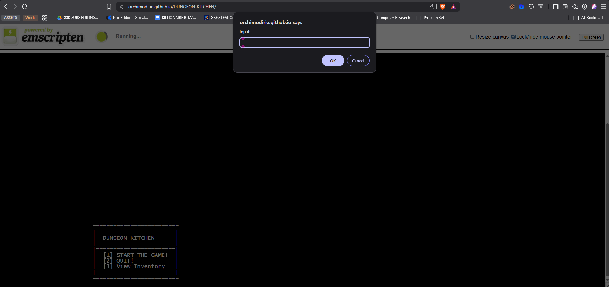

# DUNGEON KITCHEN

> "Winner Winner Chicken Dinner."

**Dungeon Kitchen RPG** is a text-based C++ roguelike adventure where you battle through infinite procedural kitchens, fight food-based monsters, and loot legendary ingredients.

## Features
### Current Beta Features
* **Procedural Encounters:** Face randomized food-based enemies with varied HP and damage stats.
* **Turn-Based Combat:** Strategic battles against *Spicy Goblins* and *Sous-Chef Skeletons* with Attack and Heal mechanics.
* **Loot & Inventory System:** Defeated enemies can drop weapons (like the *Stale Baguette* or *Saucepan of Truth*). Equip them via a custom linked-list inventory!
* **Player Progression:** Gain EXP, level up your chef, and increase your max HP and base damage to survive longer services.
* **Custom Terminal UI:** A clean, dynamic ASCII window interface replaces standard console scrolling.
* **WebAssembly Port:** Fully playable in the browser via Emscripten.

*Note: This project is currently in an early beta version. The core engine is built, but there are many more possibilities in the future!*

> Note: AI assistance was used only for setting up the online playable WebAssembly deployment link and configuring the CMake-based build process. The core implementation of the inventory linked list, game loops, FSM routing, and dynamic UI box is an original design written by the author.

### Possible Future Features
* **Save/Load Functionality:** Saving player progression and inventory between sessions.
* **Dungeon Crawler Mode:** Transitioning from an arcade-style battle gauntlet to exploring physical rooms and maps.
* **Expanded Combat & Magic:** Adding defense stats, armor equipment slots, and special chef abilities.
## Screenshot

## How to Play / Build

### Play Online (Web Version)
You can play the latest WebAssembly build directly in your browser here:
 **[Play DUNGEON KITCHEN](https://orchimodirie.github.io/DUNGEON-KITCHEN/)**

> ** Web Version Quirks:** In order for the screen to update in the browser, you may need to press the **ESC** key or click **Cancel** *one time* after you input your choice. 
> **WARNING:** Do not press Cancel unless you have already provided a prior input, or the game engine might lock up!

### Build Locally
You need a C++ compiler (GCC/Clang/MSVC) and CMake.

```bash
# 1. Clone the repository
git clone [https://github.com/orchimodirie/flavortown-rpg.git](https://github.com/orchimodirie/flavortown-rpg.git)

# 2. Navigate to the folder
cd flavortown-rpg

# 3. Create a build directory
mkdir build && cd build

# 4. Compile the game
cmake ..
make

# 5. Run!
./FlavortownRPG
